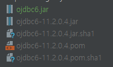

# 레거시 프로젝트

(당시엔 정리할 생각을 못해서 늦게나마 기억을 더듬어 정리를 한다...)

회사에서 가장 오래된 프로젝트이다.

가볍고 빠르지만, 10년 가까이 __말도 안되는 방식__ 으로 서비스를 하고 있었다.

프로젝트의 간략한 스펙이다.
 
> - Spring 프레임워크
>
> - 빌드 툴을 사용하지 않고 프로젝트 내부 lib 폴더에 스프링프레임워크을 갖고 있음.
>
> - 자바 1.7
>
> - Oracle 10g Enterprise Edition Release 10.2.0.1.0 
>
> - MiPlatform 320

말도 안되는 방식의 서비스란...

*운영중에 서비스가 다운되면 바로 재기동으로 대응하는 것이었다.*

서비스가 다운되면 근무 중에는 물론 퇴근 이후 심지어 새벽에도 메일 알람이 1분 마다 오는 바람에 항상 신경을 쓸 수 밖에 없었다.

재빠르게 대응하다보니 자연스럽게 내가 담당하는 일이 되었고, 귀찮음과 이해할 수 없는 운영방식에 불만이 쌓여 원인을 찾아 해결하기로 마음을 먹었다. 

---

### 1. 원인 찾기

우선 Tomcat Manager 로 다운 됐을 때 상황을 보니 Thread 가 안 죽고 계속 쌓여 요청을 처리 할 수가 없는 상황이었다.

적절한 모니터링 툴을 사용하고 있지 않아. 원인 분석을 위해 VisualVM 설치 후 모니터링을 했다.

서비스가 다운 됐을 때, VisualVM 을 통해 쓰레드덤프 (캡쳐본이 다 어디갔을까...)을 받아 분석 결과

커넥션 객체에 Blocked 가 발생해 요청이 처리 되지 않고 Thread가 무한 생성 됐다.

---

### 2. 해결 시도

우선, 커넥션 객체 반환 오류라 jdbc 관련 설정으로 해결시도 했다.

(간략하게 표현 했지만 Value 값을 바꿔가며 정말 많은 시도를 했다. )

효과가 전혀 없었다.

무한루프가 도는 로직이 있는지, Filter 를 추가해서 확인해봐도 쿼리나 로직에서 문제를 찾을 수는 없었다.

다른 방법으로는, 매번 다른 요청에서 DeadLock이 발생하여 지푸라기라도 잡는 심정으로 모든 메소드에 Timeout을 설정했다. 

하지만, 실제로 Timeout 에러 로그는 DeadLock이 시작된 이후 미친듯이 쌓이기만 했고 문제를 해결 하진 못했다. 

---

### 3. 해결

Blocked이 발생하는 객체를 따라가보니 결국 jdbc 라이브러리에 문제가 있다는 걸 발견 했다. 

(10년 넘게 운영되던 서비스였기 때문에, 라이브러리 호환이 맞지 않을 것이라고는 전혀 생각하지 못했다.)

지금 와서 생각해보면 너무 단순한 해결 방법이었지만, 당시에는 전혀 생각지도 못했던 방법이었다.

(개발 당시 개발 스펙을 고려하지 않은 채 다른 프로젝트에서 라이브러리를 가져온 것으로 생각된다.)

결국, 이제껏 시도한 모든 것을 원복하고 딱 2개만 수정을 했다. 

자바 1.7 과 오라클 10g 에 가장 최적인 버전으로 변경해줬다.

너무나... 쉽게 10년 동안 해결하지 못 한(안 한?) 오류를 해결해버렸다.

현재 서비스는 아무 문제없이 잘 운영되고 있다.

